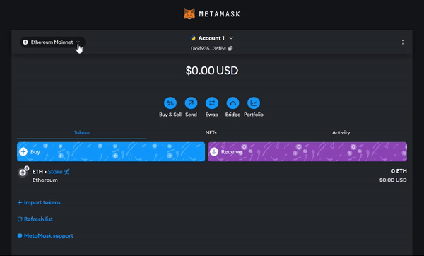
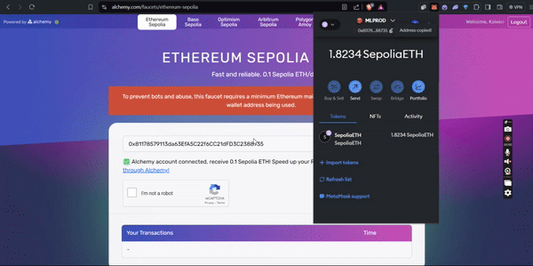

# ➡️ Getting TestNet Funds in Sepolia

## What is Sepolia?

Sepolia is one of Ethereum's test networks, designed for developers to test smart contracts and decentralized applications (dApps) in a safe environment. It operates similarly to the Ethereum mainnet but uses test ETH, which has no real-world value.

### Steps to Get Testnet Funds in ETH Sepolia

#### **Step 1: Connect MetaMask to Sepolia Testnet Using Chainlist**

* **Open MetaMask:** Ensure your MetaMask wallet is set up and open in your browser.
* **Settings:** Click on your account icon in the top right corner and select "Settings."
* **Advanced Settings:** Scroll down and find the "Advanced" tab.
* **Show Test Networks:** Toggle the "Show test networks" option to the on position.

#### **Step 2: Switch to Sepolia Testnet**

1. **Network Dropdown:** Click on the network dropdown at the top of the MetaMask interface.
2. **Select Sepolia Testnet:** You should now see the "Sepolia Test Network" listed in the dropdown. Select it to switch your network to Sepolia.

<figure><figcaption>
Enabling the testnets and switching to Sepolia network
</figcaption></figure>

**Step 3: Access a Sepolia Faucet via Alchemy**

1. **Visit Alchemy faucet:** [https://www.alchemy.com/faucets/ethereum-sepolia](https://www.alchemy.com/faucets/ethereum-sepolia). Faucets are websites that distribute small amounts of testnet ETH for free.
2. **MetaMask Account Address:** Copy your MetaMask wallet address by clicking on your account name in MetaMask.
3. **Paste Address:** Paste your MetaMask wallet address into the designated field on the faucet website.
4. **Request Funds:** Click on the button to request testnet ETH. This action will send a small amount of Sepolia ETH to your MetaMask wallet.

<figure><figcaption>
Requesting testnet fund via Alchemy
</figcaption></figure>
