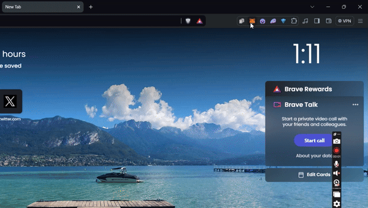

# ➡️ Setting up Hardhat

In this section, it is assumed that you have completed all the necessary prerequisites to ensure a seamless experience moving forward. However, if this is not the case, you may refer to the following  [.](./ "mention")

## Setting up local environment and installing dependencies

Open your command line, navigate to your desktop by entering `cd Desktop`. Then, create a new folder and move into it with the command: `mkdir devup-workshop1 && cd devup-workshop1`. Open your VSCode and navigate to this newly created folder.

<figure><figcaption>
Creating a folder from the command line and moving into it
</figcaption></figure>

Initialize the npm project by running `npm init -y` in the terminal

<figure><figcaption>
Initialinzing npm
</figcaption></figure>

Create an environment variable file using your terminal. This file should contain the secret key(s) needed to ensure a successful deployment and configuration of our smart contract.

* For Windows, enter `echo. > .env`
* For Mac, Linux, enter `touch .env`

From the terminal, install [Hardhat](https://www.npmjs.com/package/hardhat) and [dotenv](https://www.npmjs.com/package/dotenv) packages by `npm i hardhat dotenv` - this command will work for both Windows, Mac and Linux platforms.

<figure><figcaption>
Successful installation of Hardhat and dotenv packages
</figcaption></figure>

<figure><figcaption>
You will also notice a new folder names <code>node_modules</code> in your VSCode directory after performing the installation 
</figcaption></figure>

## Creating local Hardhat instance

From the terminal, run `npx hardhat` and the terminal will prompt a series of questions. Follow through the answers below:

* What do you want to do: **Create a new JavaScript project**
* Hardhat project root: **Press enter key**
* Do you want to add a `.gitignore`: **y**
* Do you want to install this sample project's dependencies with npm: **y**

Once all prompts has been answered, Hardhat will install all the necessary dependencies from NPM and once successful, you should receive a screen below

<figure><figcaption>
Answering Hardhat prompts and allowing it to install the necessary dependencies
</figcaption></figure>

## Setting up Hardhat' s config

On your VSCode, you should see a file named `hardhat.config.js`

Update your hardhat.config.js to mimic the changes below.



### What's going on the code above?

* **Importing Plugins and Configurations**:
  * The code starts by importing the necessary plugins and configurations needed for Hardhat, a development environment for Ethereum.
* **Loading Environment Variables**:
  * It uses the `dotenv` package to load environment variables from a `.env` file. This allows the code to securely manage sensitive information like private keys without hardcoding them in the script.
* **Extracting the Private Key**:
  * It extracts the `TESTNET_PRIVATE_KEY` from the environment variables. This private key will be used to sign transactions when deploying contracts.
* **Exporting the Configuration**:
  * The configuration for Hardhat is exported. This configuration includes:
    * **Solidity Compiler Version**: Specifies that version `0.8.24` of the Solidity compiler should be used.
    * **Network Configuration**: Defines settings for connecting to the Sepolia testnet.
      * **URL**: Provides the endpoint URL to connect to the Sepolia testnet.
      * **Accounts**: Specifies that the private key loaded from the environment variables should be used to deploy contracts.

## Extracting your Metamask Account's Private Key

**1. Open MetaMask**

* Open your web browser.
* Click on the MetaMask extension icon in the top right corner of your browser.

**2. Unlock MetaMask**

* If your MetaMask is locked, enter your password to unlock it.

**3. Select the Account**

* Click on the account you want to export the private key from. This is usually displayed as “Account 1”, “Account 2”, etc., with the associated Ethereum address.

**4. Access Account Details**

* Click on the three dots (menu) icon located in the top right corner of the account card.
* Select “Account Details” from the dropdown menu.

**5. Export Private Key**

* In the “Account Details” window, click on the “Export Private Key” button.
* MetaMask will ask for your password to confirm your identity. Enter your MetaMask password and click “Confirm”.

**6. Copy the Private Key**

* After confirmation, MetaMask will display your private key. Copy this key and store it securely. **Do not share this key with anyone**.

<figure><figcaption>
Extracting the private keys from Metamask
</figcaption></figure>

**7. Securely Store the Private Key**

* Paste the copied private key into the `.env` file. **Do not leave it exposed** anywhere


Paste your private key from Metamask to your .env file as see above

