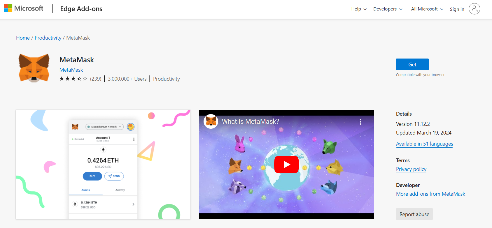

# ➡️ Setting up Metamask

## Why MetaMask?

MetaMask provides a user-friendly interface for managing your cryptocurrencies and interacting with the Ethereum blockchain and other compatible networks. It bridges the gap between web browsers and the Ethereum blockchain, allowing users to run Ethereum decentralized applications (dApps) right in their browser without running a full Ethereum node.

## Step-by-Step Guide to Setting Up a MetaMask Wallet

#### **Step 1: Install MetaMask**

* **Choose Your Browser:** MetaMask is available as an extension for Chrome, Firefox, Brave, and Edge. Open your preferred browser.
* **Visit the MetaMask Website:** Go to the official MetaMask website at [metamask.io](https://metamask.io/). OR -&#x20;
* **Download the Extension:** Click on the "Download" button and follow the prompts to add the MetaMask extension to your browser.
* Additionally, you may download Metamask from different browsers below:
  * Google Chrome: [https://chromewebstore.google.com/detail/metamask/nkbihfbeogaeaoehlefnkodbefgpgknn](https://chromewebstore.google.com/detail/metamask/nkbihfbeogaeaoehlefnkodbefgpgknn)
  * Edge: [https://microsoftedge.microsoft.com/addons/detail/metamask/ejbalbakoplchlghecdalmeeeajnimhm?hl=en-US](https://microsoftedge.microsoft.com/addons/detail/metamask/ejbalbakoplchlghecdalmeeeajnimhm?hl=en-US)
  * Firefox: [https://addons.mozilla.org/en-US/firefox/addon/ether-metamask](https://addons.mozilla.org/en-US/firefox/addon/ether-metamask/)
  * Brave: [https://chromewebstore.google.com/detail/metamask/nkbihfbeogaeaoehlefnkodbefgpgknn](https://chromewebstore.google.com/detail/metamask/nkbihfbeogaeaoehlefnkodbefgpgknn)
  * Opera: [https://addons.opera.com/en-gb/extensions/details/metamask-10](https://addons.opera.com/en-gb/extensions/details/metamask-10/)

<figure><figcaption>
Downloading Metamask using Edge browser
</figcaption></figure>

#### **Step 2: Create a New Wallet**

1. **Open MetaMask:** Click on the MetaMask icon in your browser's toolbar to open the extension.
2. **Get Started:** Click on the "Get Started" button.
3. **Create a Wallet:** Select the option to create a new wallet. MetaMask will ask if you want to help improve MetaMask by sharing anonymous usage data. Choose your preference and click "I Agree" or "No Thanks."
4. **Set a Password:** Create a strong password for your wallet. This password will be used to unlock MetaMask on your device. Ensure it is at least 8 characters long, includes a mix of letters, numbers, and special characters. Enter the password and click "Create."

<figure><figcaption>
Creating a new wallet for the first time
</figcaption></figure>

#### **Step 3: Secure Your Wallet**

1. **Backup Secret Recovery Phrase:** MetaMask will now display a 12-word Secret Recovery Phrase. This phrase is crucial for accessing your wallet if you forget your password or need to restore your wallet on a new device.
2. **Write It Down:** Write down the 12-word phrase on a piece of paper. Do not store it digitally (e.g., taking a screenshot) to avoid potential hacks.

<figure><figcaption></figcaption></figure>

1. **Confirm Recovery Phrase:** MetaMask will ask you to confirm the Secret Recovery Phrase by selecting the words in the correct order. This step ensures that you have correctly backed up your phrase.
2. **Secure Storage:** Store your written recovery phrase in a secure location, such as a safe or a safety deposit box. Do not share it with anyone.

